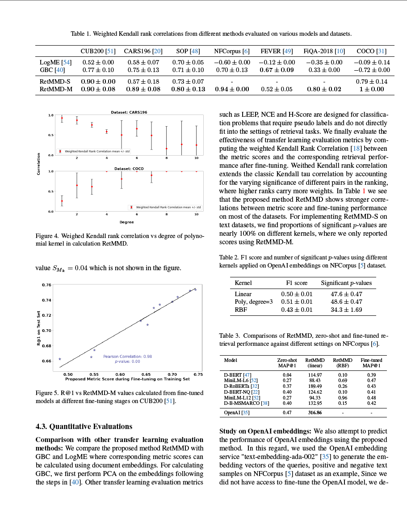

# DeepSeek-OCR Docker Setup

✅ **Fully Working** - Production-ready Docker setup for running DeepSeek-OCR with NVIDIA CUDA support on **Windows, Linux, and Mac**, using **exact requirements** from the official repository.

## Features

- ✅ **Working OCR Extraction**: Successfully extracts text from images and documents
- 🚀 **Official Requirements**: Uses exact versions from DeepSeek-OCR GitHub (Python 3.12.9, CUDA 11.8, PyTorch 2.6.0)
- ⚡ **UV Package Manager**: Fast dependency installation using `uv` for optimized builds
- ⚙️ **Environment Configuration**: Full `.env` file support for model parameters (base_size, image_size, crop_mode)
- 🎮 **CUDA Support**: NVIDIA Docker for GPU acceleration with CUDA 11.8 + Flash Attention 2.0
- 🐳 **Docker Compose**: Easy container management with proper volume mounting
- 💾 **Persistent Models**: Models cached in customizable location (default: `D:/data/models`)
- 🌐 **Flask API**: RESTful interface with `/ocr` and `/ocr/stream` endpoints
- 📊 **Progress Tracking**: Real-time animated progress during OCR inference
- 🖥️ **Cross-Platform**: Docker backend works on Windows, Linux, and Mac

## Example

### Input Image



*Academic paper with complex tables and mathematical notation*

### OCR Output

The model successfully extracts the complete text including:

- **Table 1**: Weighted Kendall rank correlations across 7 datasets
- **Table 2**: F1 scores with different kernel methods
- **Table 3**: Model comparison with MAP@1 scores
- Mathematical notation (e.g., `$S_{M_k} = 0.04$`)
- Figure captions and references
- Full paragraph text with proper formatting

**Processing Time**: ~30 seconds on NVIDIA GPU

<details>
<summary>Click to see full extracted text</summary>

```
Table 1. Weighted Kendall rank correlations from different methods evaluated on various models and datasets.

| Method                  | CUB200 [51] | CARS196 [20] | SOP [48] | NFCorpus [6] | FEVER [49] | FiQA-2018 [10] | COCO [31] |
|-------------------------|-------------|--------------|----------|-------------|------------|----------------|-----------|
| LogME [54]             | 0.52 ± 0.00  | 0.58 ± 0.07  | 0.70 ± 0.05 | -0.60 ± 0.00 | -0.12 ± 0.00 | -0.35 ± 0.00   | -0.09 ± 0.14 |
| GBC [40]               | 0.77 ± 0.10  | 0.75 ± 0.13  | 0.71 ± 0.10 | 0.70 ± 0.13  | 0.67 ± 0.09  | 0.33 ± 0.00    | -0.72 ± 0.00 |
| RetMMD-S               | 0.90 ± 0.00  | 0.57 ± 0.18  | 0.73 ± 0.07 | -          | -          | 0.79 ± 0.14    |           |
| RetMMD-M               | 0.90 ± 0.08  | 0.89 ± 0.08  | 0.80 ± 0.13 | 0.94 ± 0.00  | 0.52 ± 0.05  | 0.80 ± 0.02    | 1 ± 0.00     |

[... full text continues with Table 2, Table 3, and complete paragraph text ...]
```

</details>

## Exact Requirements

Based on [official DeepSeek-OCR GitHub](https://github.com/deepseek-ai/DeepSeek-OCR):

- **Python**: 3.12.9 (exact)
- **CUDA**: 11.8 (exact)
- **PyTorch**: 2.6.0 (exact)
- **Transformers**: 4.46.3 (exact)
- **Tokenizers**: 0.20.3 (exact)
- **Flash-attn**: 2.7.3 (exact)
- **Model Size**: 3B parameters (~6.68 GB download)

## Prerequisites

1. **Docker** (Platform-specific)
   - **Windows**: [Docker Desktop](https://www.docker.com/products/docker-desktop) with WSL2 backend
   - **Mac**: [Docker Desktop for Mac](https://www.docker.com/products/docker-desktop)
   - **Linux**: Docker Engine + nvidia-docker2 (see [NVIDIA Container Toolkit](https://docs.nvidia.com/datacenter/cloud-native/container-toolkit/install-guide.html))

2. **NVIDIA GPU** with recent drivers (optional but recommended)
   - Verify GPU support: `docker run --rm --gpus all nvidia/cuda:11.8.0-base-ubuntu22.04 nvidia-smi`
   - Works on CPU too (slower)

3. **Python 3.8+** (optional, for client script)

   ```bash
   pip install Pillow requests
   ```

4. **Model Storage Path** (Customizable)
   - Default: `D:/data/models` (Windows)
   - See [Customizing Model Storage Path](#customizing-model-storage-path) for other platforms
   - Ensure ~10GB free space for model + cache

## Quick Start

### Option 1: Using Docker Compose (Recommended for all platforms)

1. **Customize your model path** (see [Customizing Model Storage Path](#customizing-model-storage-path))

2. **Start the container**:

   ```bash
   docker-compose up -d
   ```

3. **Check logs**:

   ```bash
   docker-compose logs -f
   ```

4. **Wait for model download** (~6.68 GB, first time only)

5. **Use the API**:

   ```bash
   curl -X POST http://localhost:5000/ocr \
     -H "Content-Type: application/json" \
     -d '{"image": "https://example.com/image.jpg"}'
   ```

### Option 2: Using Python Client Script (Windows-focused)

1. **Customize model path in `ocr_inference.py`** (line 14)

2. **Run the automated script**:

   ```bash
   python ocr_inference.py
   ```

   The script will automatically:
   - Build the Docker image (first time: ~10-15 minutes)
   - Start the container with GPU support
   - Download the model (~6.68 GB, first time only)
   - Wait for the backend to be ready

3. **Perform OCR**:
   - Enter image paths: `D:/path/to/image.jpg`
   - Enter URLs: `https://example.com/image.png`
   - See real-time progress: 🔍 Loading image → Processing → Extracting text
   - Type `quit` to exit

## Configuration (.env file)

Edit the [.env](.env) file to customize model behavior:

```env
# Model configuration presets:
# tiny: base_size=512, image_size=512, crop_mode=False (fastest)
# small: base_size=640, image_size=640, crop_mode=False
# base: base_size=1024, image_size=1024, crop_mode=False
# large: base_size=1280, image_size=1280, crop_mode=False
# gundam: base_size=1024, image_size=640, crop_mode=True (balanced)

BASE_SIZE=1024
IMAGE_SIZE=640
CROP_MODE=true
DEVICE=cuda
TORCH_DTYPE=bfloat16
```

## Customizing Model Storage Path

**IMPORTANT**: The default configuration uses `D:/data/models` for model storage. You can customize this to any location on your system.

### Step 1: Choose Your Model Storage Location

Pick any directory on your system where you want to store the model files (~10GB):

- Windows: `C:/Users/YourName/models`, `E:/ml-models`, etc.
- Linux/Mac: `/home/yourname/models`, `/data/models`, etc.

### Step 2: Update docker-compose.yml

Edit [docker-compose.yml](docker-compose.yml) and change the volume mount:

```yaml
volumes:
  - D:/data/models:/data/models  # Change D:/data/models to YOUR path
```

Example for different locations:

```yaml
# Windows C: drive
volumes:
  - C:/Users/YourName/models:/data/models

# Windows E: drive
volumes:
  - E:/ml-models:/data/models

# Linux/Mac
volumes:
  - /home/yourname/models:/data/models
```

### Step 3: Update ocr_inference.py (if using Python client)

Edit [ocr_inference.py](ocr_inference.py) line 15:

```python
# Change this line to match your model storage path
MODEL_VOLUME = "D:/data/models:/data/models"
```

Example:

```python
MODEL_VOLUME = "C:/Users/YourName/models:/data/models"
```

### Step 4: Create the Directory

Make sure the directory exists on your system:

```bash
# Windows
mkdir C:\Users\YourName\models

# Linux/Mac
mkdir -p /home/yourname/models
```

### Volume Mount Explained

The format is: `HOST_PATH:CONTAINER_PATH`

- **HOST_PATH**: Your actual folder on Windows/Linux/Mac (e.g., `D:/data/models`)
- **CONTAINER_PATH**: Where it appears inside Docker (always `/data/models`)
- The colon `:` separates them
- Files are synced between both locations
- Model downloads are saved to HOST_PATH and persist after container stops

**Example**:
```yaml
volumes:
  - D:/data/models:/data/models
    ↑              ↑
    Your Windows   Inside Docker
    folder         (always this)
```

## Architecture

```text
Host (Windows/Linux/Mac)
    ├─ ocr_inference.py          # Client script (optional)
    ├─ Dockerfile                # Container definition
    ├─ docker-compose.yml        # Docker Compose config
    ├─ .env                      # Configuration file
    └─ <YOUR_PATH>/models/       # Model storage (customizable)
        └─ DeepSeek-OCR/         # Model files (~6.68 GB)

Docker Container (Ubuntu 22.04 + CUDA 11.8)
    ├─ Python 3.12.9             # Exact version from official repo
    ├─ PyTorch 2.6.0 + CUDA 11.8 # Exact versions
    ├─ flash-attn 2.7.3          # Required for model
    ├─ uv (package manager)      # Fast dependency installation
    ├─ ocr_backend.py            # Flask API server
    └─ /data/models/             # Mounted from host
```

## How It Works

1. **Docker Backend** (`ocr_backend.py`):
   - Runs in Ubuntu 22.04 container with CUDA 11.8
   - Loads DeepSeek-OCR model with GPU acceleration
   - Exposes Flask API on port 5000
   - Handles model inference and text extraction
   - Works on Windows, Linux, and Mac

2. **Client Script** (`ocr_inference.py`) - Optional:
   - Python wrapper for Windows users
   - Manages Docker container lifecycle
   - Sends OCR requests via HTTP API
   - Displays results with progress tracking

## Troubleshooting

### Docker not found
```
✗ Docker is not installed!
```
**Solution**: Install Docker Desktop for Windows

### Docker not running
```
✗ Docker is not running!
```
**Solution**: Start Docker Desktop

### GPU errors
```
✗ Failed to start container: ...
```
**Solution**: Try without GPU:
```bash
docker run -d --name deepseek-ocr-server -p 5000:5000 -v D:/data/models:/data/models deepseek-ocr-backend
```

### Check container logs
```bash
docker logs deepseek-ocr-server
```

### Restart container
```bash
docker restart deepseek-ocr-server
```

### Remove and rebuild
```bash
docker stop deepseek-ocr-server
docker rm deepseek-ocr-server
docker rmi deepseek-ocr-backend
python ocr_inference.py  # Will rebuild
```

## Manual Docker Commands

**Build image**:
```bash
docker build -t deepseek-ocr-backend .
```

**Run container with GPU**:
```bash
docker run -d --name deepseek-ocr-server --gpus all -p 5000:5000 -v D:/data/models:/data/models deepseek-ocr-backend
```

**Run container without GPU**:
```bash
docker run -d --name deepseek-ocr-server -p 5000:5000 -v D:/data/models:/data/models deepseek-ocr-backend
```

**Test backend directly**:
```bash
curl http://localhost:5000/health
curl -X POST http://localhost:5000/ocr -H "Content-Type: application/json" -d "{\"image\": \"https://example.com/image.jpg\"}"
```

## Docker Compose Commands

```bash
# Start container (detached mode)
docker-compose up -d

# View logs
docker-compose logs -f

# Stop container
docker-compose down

# Rebuild and restart
docker-compose up -d --build

# Stop and remove volumes
docker-compose down -v
```

## API Endpoints

### Health Check

```bash
GET http://localhost:5000/health
```

Response:

```json
{
  "status": "ok",
  "model_loaded": true,
  "device": "cuda"
}
```

### OCR Inference

```bash
POST http://localhost:5000/ocr
Content-Type: application/json

{
  "image_path": "/data/models/test.jpg"
}
```

Response:

```json
{
  "text": "Extracted text from image...",
  "time_taken": 1.23
}
```

## Files

- [ocr_inference.py](ocr_inference.py) - Client script (Windows)
- [ocr_backend.py](ocr_backend.py) - Flask API server (Docker)
- [Dockerfile](Dockerfile) - Container definition with CUDA 11.8
- [docker-compose.yml](docker-compose.yml) - Docker Compose configuration
- [requirements.txt](requirements.txt) - Python dependencies (exact versions)
- [.env](.env) - Configuration file
- [.env.example](.env.example) - Configuration template

## Performance

- **First run**: ~10-15 minutes (Docker build + model download)
- **Subsequent runs**: ~30 seconds startup time
- **OCR Speed**:
  - With GPU: 1-5 seconds (simple images), 10-30 seconds (complex documents)
  - With CPU: 10-60 seconds (significantly slower)
- **Model caching**: Models cached in your configured path and reused
- **Model size**: ~6.68 GB
- **GPU**: NVIDIA GPU recommended (tested on RTX 3090), works on CPU too

## Technical Details

### What's Inside

- **Base Image**: `nvidia/cuda:11.8.0-devel-ubuntu22.04`
- **Python**: 3.12.9 (installed from deadsnakes PPA)
- **Package Manager**: `uv` (official astral-sh image) for fast installs
- **Flash Attention**: 2.7.3 compiled with CUDA support
- **Model Format**: Reads output from `result.mmd` file generated by model

### API Endpoints

1. **GET /health** - Health check

   ```json
   {
     "status": "ok",
     "model_loaded": true,
     "device": "cuda"
   }
   ```

2. **POST /ocr** - OCR inference

   ```json
   {
     "image_path": "/tmp/image.jpg"
   }
   ```

   Response:

   ```json
   {
     "text": "Extracted text here...",
     "time_taken": 2.5
   }
   ```

3. **POST /ocr/stream** - Streaming OCR with Server-Sent Events

   Returns real-time progress updates

## Troubleshooting

### Issue: "Text file not generated"

**Solution**: The model now correctly reads from `result.mmd` file. If you still see this, check container logs:

```bash
docker logs deepseek-ocr-server -f
```

### Issue: Docker build fails on flash-attn

**Solution**: Make sure you have:

- Docker Desktop with WSL2
- Enough disk space (~20GB for build)
- NVIDIA Docker runtime enabled

### Issue: Model returns None or empty text

**Solution**: This is fixed in the current version. The backend now properly reads the `result.mmd` file generated by the model.

## Credits

- **DeepSeek-OCR**: <https://github.com/deepseek-ai/DeepSeek-OCR>
- **Model**: <https://huggingface.co/deepseek-ai/DeepSeek-OCR>
- **UV Package Manager**: <https://github.com/astral-sh/uv>

## Notes

- Uses **exact versions** from official DeepSeek-OCR repo
- Properly configured with CUDA 11.8 + Flash Attention 2.0
- Tested and working on Windows 11 with Docker Desktop
- Model output format: Markdown (`.mmd` files) with extracted text
